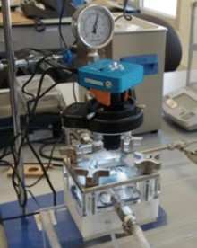
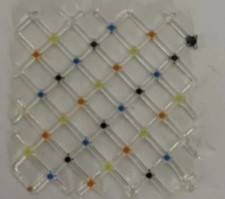
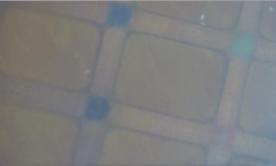
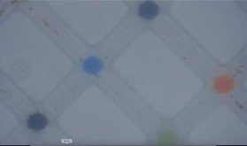
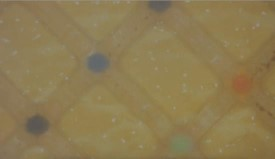
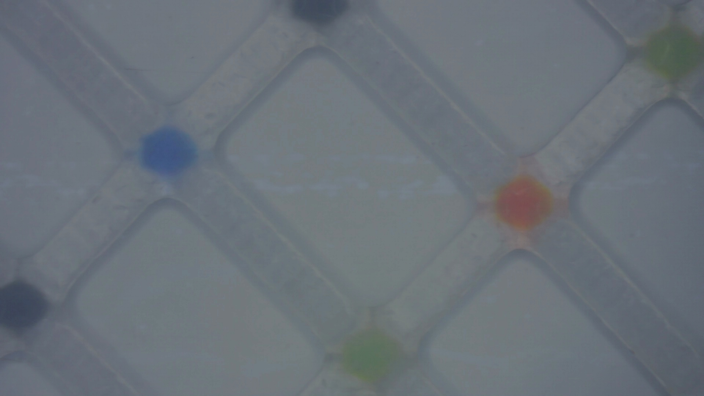
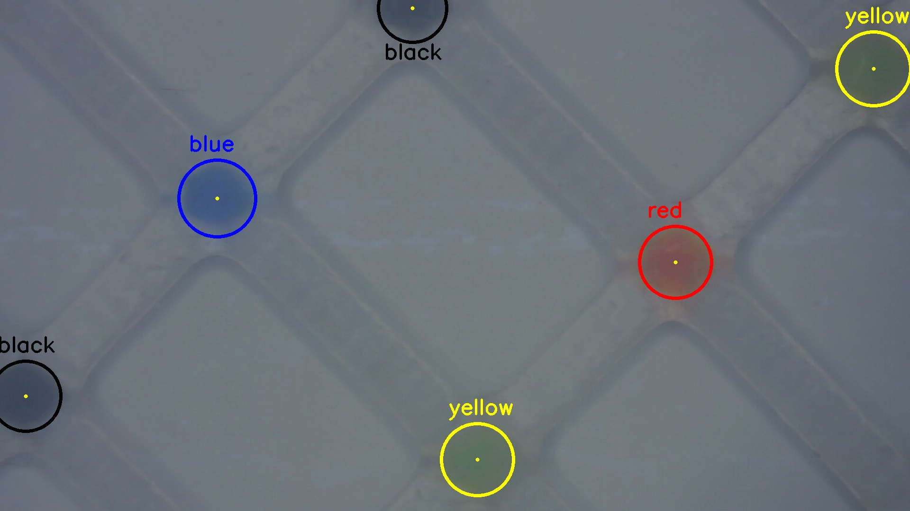

# Membrane Image Analysis

**Yuval Amir**  

---
## Project Description

Detect colored markers on a membrane filmed through varying water clarity.The camera is mounted above a water tank, capturing the membrane at the bottom under different turbidity levels. As water quality degrades, colored circular markers appear differently and must be accurately identified and tracked.

**Camera setup:** 

  

**Membrane out of water:** 

  

**Sample frames:**

  
 
  

## Introduction

This project consists of two main parts:

1. **detect_colored_circles**  
   Detects colored circles in a single membrane image.

2. **track_circles_over_time**  
   Tracks circles over a sequence of images and produces a unified result table.

---

## Installation

1. **Clone the repository**  

   git clone https://github.com/YuvalAmir1551/Membrane_Image_Analysis.git
   cd Membrane_Image_Analysis

2. **Create and activate a virtual environment**  

   python -m venv env
   source env/bin/activate      # On Windows: env\Scripts\activate

3. **Install dependencies**  

   pip install -r requirements.txt

---

## Usage

Run the analysis via the provided main.py script.

### Prerequisites

- Python 3.7+
- Dependencies installed via `pip install -r requirements.txt`

### Single-frame detection:
	
	python main.py examples/seq_000.jpg
	
### Tracking over time:
	
	python main.py --track examples/seq_000.jpg examples/seq_001.jpg examples/seq_002.jpg

### Tracking + generate Markdown table
	
	python main.py --track --output-table examples/seq_000.jpg examples/seq_001.jpg examples/seq_002.jpg

---

## Examples

#### Single-frame detection

  

#### Tracking output (Markdown table)

| image | circle_id |   x  |   y  | radius | color  |
|:-----:|:---------:|:----:|:----:|:------:|:-------|
|  1    |     1     |  458 |  419 |   81   | blue   |
|  1    |     2     |  1425|  554 |   76   | red    |
|  1    |     3     |  1007|  971 |   76   | yellow |
|  1    |     4     |  1843|  145 |   78   | yellow |
|  1    |     5     |  54  |  837 |   74   | black  |
|  1    |     6     |  870 |  17  |   72   | black  |
